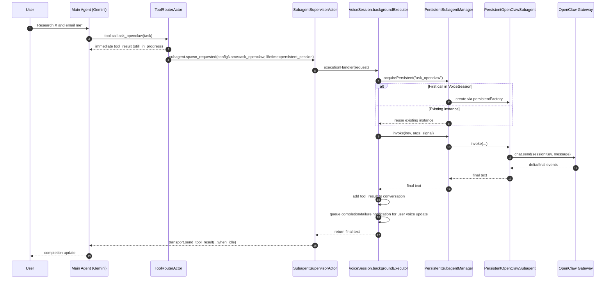
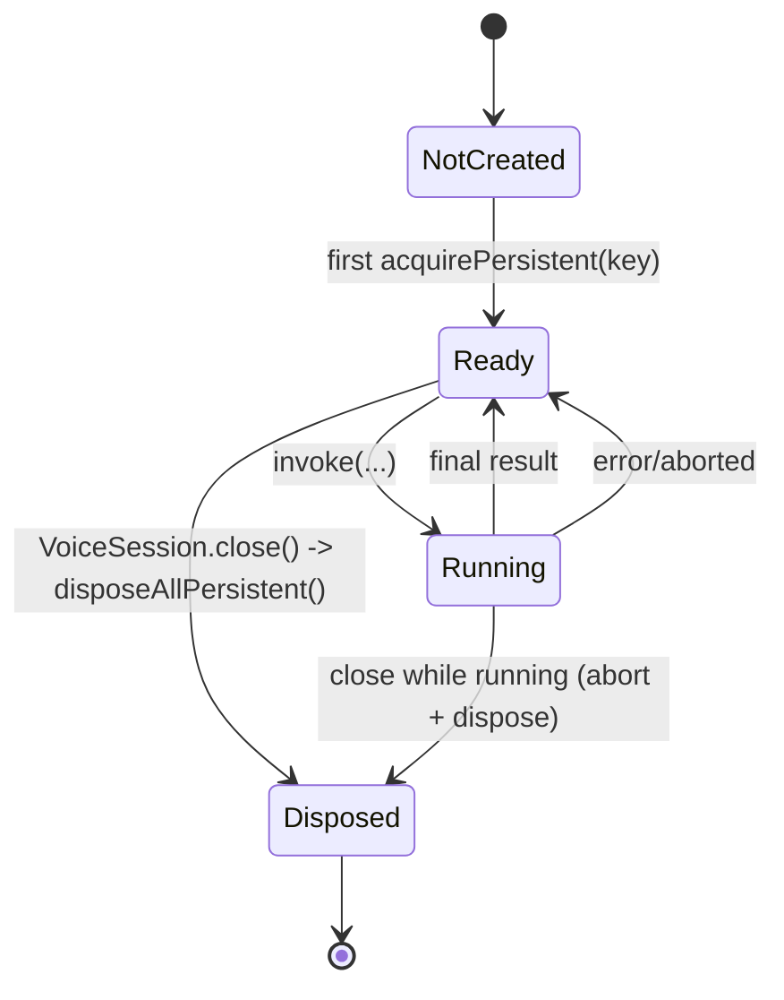

# Persistent Subagent Lifecycle

This page documents the current actor-runtime lifecycle for `persistent_session` subagents (for example, `ask_openclaw` in `app/openclaw-demo.ts`).

## Where It Is Configured

- `ask_openclaw` is wired to a persistent config via `createPersistentOpenClawSubagentConfig(...)`.
- That config sets:
  - `lifetime: 'persistent_session'`
  - `persistentFactory: (...) => new PersistentOpenClawSubagent(...)`

## End-to-End Sequence

## Persistent Instance State

## Ownership Boundaries

- `ToolRouterActor`: decides inline vs background; emits `subagent.spawn_requested`.
- `SubagentSupervisorActor`: owns workflow state (`running`, `waiting_input`, `completed`, `failed`, `cancelled`).
- `VoiceSession.backgroundExecutor`: picks persistent vs fallback handoff execution path.
- `PersistentSubagentManager`: owns persistent instance registry and reuse by key.
- `PersistentOpenClawSubagent`: owns provider call loop (`chatSend` + streamed `nextChatEvent`).

## Key Behavior Notes

- One persistent instance per `(VoiceSession, subagent key)`; current key is `configName` (for `ask_openclaw`, key is `ask_openclaw`).
- Persistent instances are disposed when `VoiceSession.close()` runs.
- For tools with `pendingMessage`, completion/failure updates are queued as system notifications so the main LLM can reliably speak progress back.

## Routing Precedence (OpenClaw Demo)

In `app/openclaw-demo.ts`, explicit mentions of OpenClaw route to `ask_openclaw`, but media generation has higher precedence:

- Image/visual generation requests must route to `generate_image`.
- Video/motion generation requests must route to `generate_video`.
- OpenClaw is not used for image/video generation in this demo configuration.

This prevents explicit phrases like "use OpenClaw" from accidentally bypassing media tools for image/video tasks.

## Code Map

- `app/openclaw-demo.ts`
- `app/lib/openclaw-tools.ts`
- `app/lib/persistent-openclaw-subagent.ts`
- `src/core/voice-session.ts`
- `src/agent/persistent-subagent-manager.ts`
- `src/runtime/actors/tool-router-actor.ts`
- `src/runtime/actors/subagent-supervisor-actor.ts`
- `src/transport/gemini-live-transport.ts`
