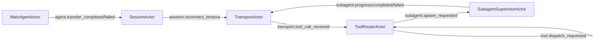

# Actor Runtime Pattern

The framework has two orchestration modes:

- `legacy`: classic router-based flow
- `actor`: message-driven actor runtime

This page explains the actor model used when `orchestrationMode: 'actor'`.

## Why actor mode exists

Actor mode makes control flow explicit and deterministic for complex sessions (tools, subagents, reconnection, and transfers) by using:

- isolated actor state
- message-only coordination
- per-actor serialized mailboxes
- supervision policies for failures

Audio still uses a direct fast-path and does not go through actor mailboxes.

## Core pieces

The runtime is centered on:

- `ActorRuntime` (`src/runtime/actor-runtime.ts`)
- `RuntimeOrchestrator` (`src/runtime/runtime-orchestrator.ts`)
- runtime message contracts (`src/runtime/messages.ts`)

Main actors:

- `SessionActor`: session phase + reconnect timing
- `TransportActor`: transport IO bridge
- `ToolRouterActor`: tool dispatch (inline/background/transfer)
- `SubagentSupervisorActor`: background workflow lifecycle
- `MainAgentActor`: agent transfer lifecycle hooks
- `ClientGatewayActor`: client message bridge

## Actor invariants

1. One actor processes one message at a time.
2. Actor state is private; no cross-actor mutation.
3. Coordination happens through envelopes/messages only.
4. Timeouts are modeled as messages (`*.timeout`).
5. Failures are handled via supervisor policy (`restart`, `resume`, `stop`, `escalate`).

## Message flow (high level)



Typical paths:

- Inline tool: `transport.tool_call_received` -> `tool.inline.completed` -> `transport.send_tool_result`
- Background tool: `transport.tool_call_received` -> `subagent.spawn_requested` -> `subagent.completed` -> `transport.send_tool_result`
- Transfer: `agent.transfer_requested` -> `transport.transfer_session` -> `agent.transfer_completed`

## How to enable actor mode

Use `orchestrationMode: 'actor'` in `VoiceSession` config:

```ts
import { VoiceSession } from '../../src/core/voice-session.js';

const session = new VoiceSession({
  sessionId: 'session_1',
  userId: 'user_1',
  apiKey: process.env.GEMINI_API_KEY!,
  agents: [mainAgent],
  initialAgent: 'main',
  port: 9900,
  model: google('gemini-2.5-flash'),
  orchestrationMode: 'actor',
});
```

Notes:

- `ttsProvider` support requires actor mode.
- Legacy mode remains available for compatibility.

## When to use actor mode

Prefer actor mode when you need:

- persistent subagent lifecycle control
- strict timeout/retry/message ordering
- richer observability of runtime internals
- stronger fault isolation between orchestration components

Use legacy mode only if you need minimal migration risk for older flows.

## Related docs

- [Subagent Patterns](/advanced/subagents)
- [Persistent Subagent Lifecycle](/advanced/persistent-subagent-lifecycle)
- [API: ActorRuntime](/api/classes/ActorRuntime)
- [API: RuntimeOrchestrator](/api/classes/RuntimeOrchestrator)
